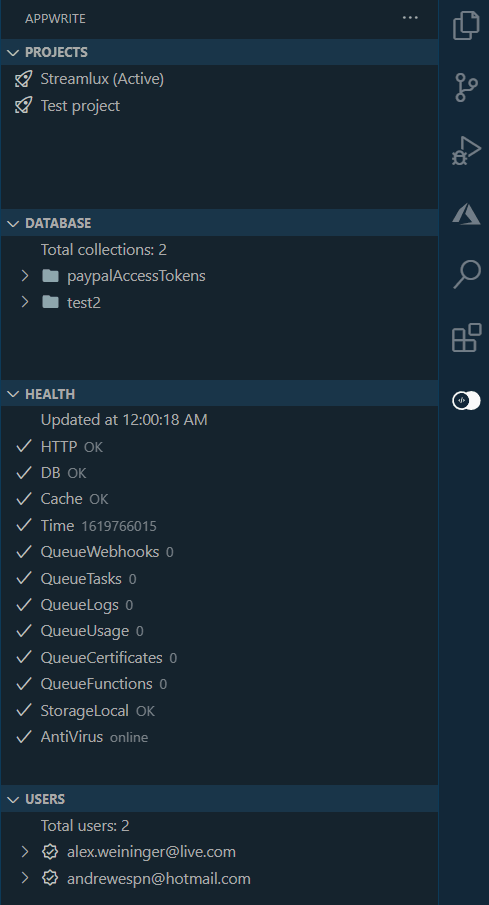
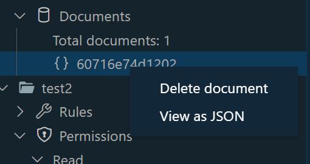
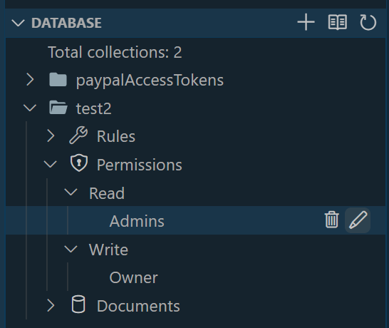
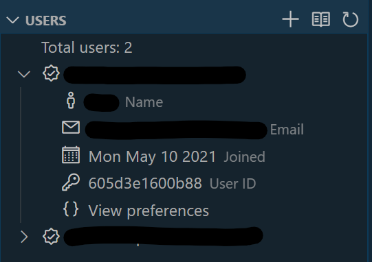
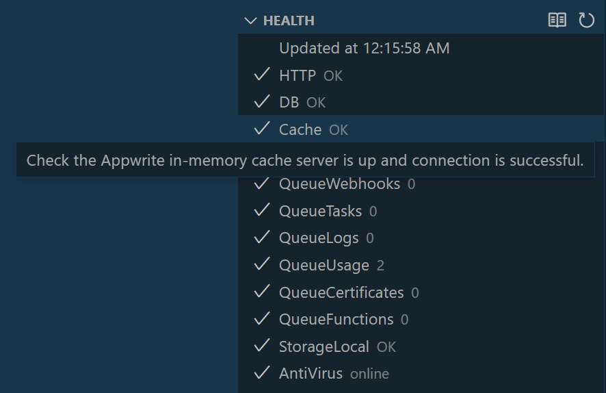

# Appwrite for Visual Studio Code

Use the Appwrite extension to quickly monitor, manage, and interact with your Appwrite instance directly from VS Code.

## What is Appwrite?

From [appwrite.io](https://appwrite.io)

> Secure Open-Source Backend Server for Web, Mobile & Flutter Developers
>
> Appwrite is a self-hosted solution that provides developers with a set of easy-to-use and integrate REST APIs to manage their core backend needs.

## Features

### Connect to multiple Appwrite projects



### View database documents right inside VS Code.



### Manage database collection permissions and rules.



### Create and view users, user preferences, and more.


### Quickly and easily check the health of all the Appwrite services.



## Requirements

This extension does not provide features for setting up or installing Appwrite. Only managing and interacting with Appwrite once it's running.

## Extension Settings

Include if your extension adds any VS Code settings through the `contributes.configuration` extension point.

For example:

This extension contributes the following settings:

* `appwrite.projects`: List of Appwrite project configurations. To set up a project configuration, run the `Connect to Appwrite` command. Search commands by hitting <kbd>F1</kbd>, then search `Connect to Appwrite`.

After connecting to an Appwrite project, your `appwrite.projects` setting will contain:

```json
{
            "endpoint": "https://[Domain]/v1",
            "projectId": "[Project ID]",
            "secret": "API key with all scopes",
            "nickname": "My project"
}
```

We plan on adding better multi-project support in the future.

## Known Issues

If you find issues, or want to suggest features, please file them in the issues section of the repository.

This extension has not been tested with large >1000 users or documents so it may hang or slow down if you try to load collections with large amounts of documents. If this is the case please report it!

### 1.0.0

Initial release of the Appwrite extension for VS Code.

The initial release only includes features for Database, Users, and Health Appwrite APIs. However support for Storage and Functions APIs is on the way.


-----------------------------------------------------------------------------------------------------------

## Contributing

There are a couple of ways you can contribute to this repo:

* **Ideas, feature requests and bugs**: We are open to all ideas and we want to get rid of bugs! Use the Issues section to either report a new issue, provide your ideas or contribute to existing threads.
* **Documentation**: Found a typo or strangely worded sentences? Submit a PR!
* **Code**: Contribute bug fixes, features or design changes:
  * Clone the repository locally and open in VS Code.
  * Open the terminal (press <kbd>CTRL</kbd>+ <kbd>\`</kbd>) and run `npm install`.
  * Debug: press <kbd>F5</kbd> to start debugging the extension.

## License

[MIT](LICENSE.md)

**Enjoy!**
